# Endogenous Technology and Network Dynamics in AI Adoption

[**Read the paper (PDF)**](latex/paper_en.pdf)

**A Factorial Agent-Based Study**

Fifth paper in the [complexity-econ](https://github.com/complexity-econ) series. Tests whether the universality of AI adoption phase transitions (established in [Paper 04](https://github.com/complexity-econ/paper-04-phase-diagram)) survives when both the sectoral elasticity of substitution (σ) and the inter-firm network are made endogenous.

## Key Findings

- The **reentrant (inverted-U) adoption shape** survives in all four factorial cells
- Endogenous σ preserves BDP_c = 500 PLN up to moderate learning rates (λ ≤ 0.02)
- Dynamic network rewiring shifts BDP_c to 750 PLN for intermediate rates (ρ ∈ [0.02, 0.10])
- The combined effect is **superadditive** (+6.5 pp peak adoption vs. baseline)
- Endogenous σ does **not** produce self-organized criticality (SOC)

## Experimental Design

2×2 factorial: (fixed/endogenous σ) × (static/dynamic network), plus two marginal sensitivity sweeps.

| Campaign | Simulations | Description |
|----------|------------|-------------|
| C1 Factorial | 2,520 | 4 cells × 21 BDP × 30 seeds |
| C2 Lambda | 3,780 | 6 λ values × 21 BDP × 30 seeds |
| C3 Rho | 3,780 | 6 ρ values × 21 BDP × 30 seeds |
| **Total** | **10,080** | |

## Figures

### Factorial Bifurcation (2×2 Design)

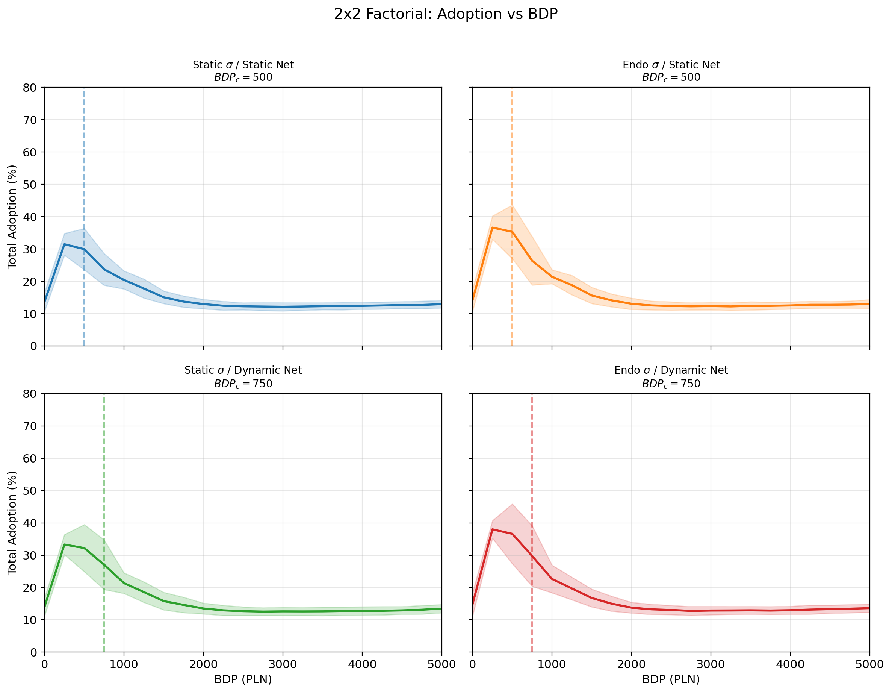
**Fig 1.** Adoption vs BDP across all four factorial cells. The reentrant (inverted-U) shape survives endogenization — static cells peak at BDP_c = 500, dynamic network cells shift to BDP_c = 750.

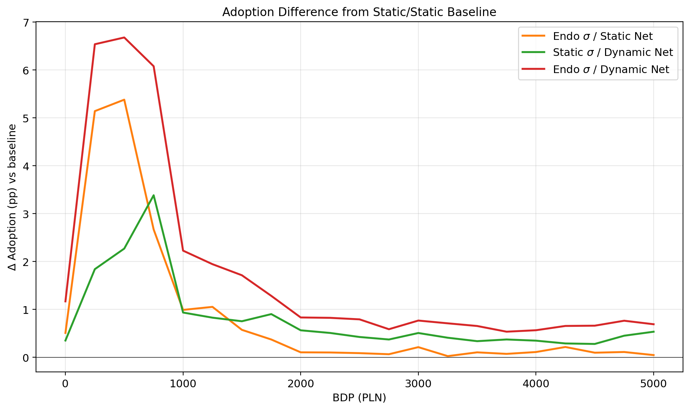
**Fig 2.** Adoption difference relative to the static/static baseline. The full endogenous cell (red) peaks at +6.7 pp — effects are superadditive near the critical region.

### Endogenous σ Trajectories

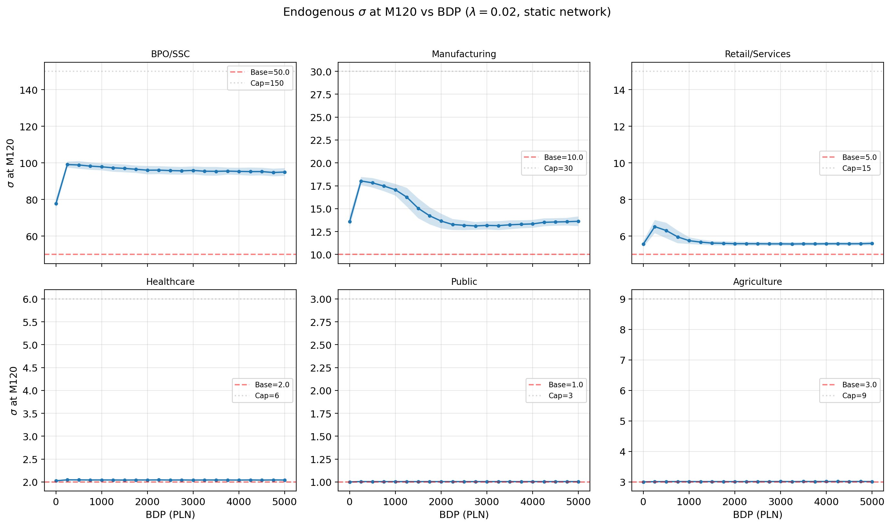
**Fig 3.** Terminal σ at month 120 for each sector under learning-by-doing (λ = 0.02). BPO/SSC nearly doubles its elasticity; low-digital sectors (Public, Agriculture) barely move — a Matthew effect in technology diffusion.

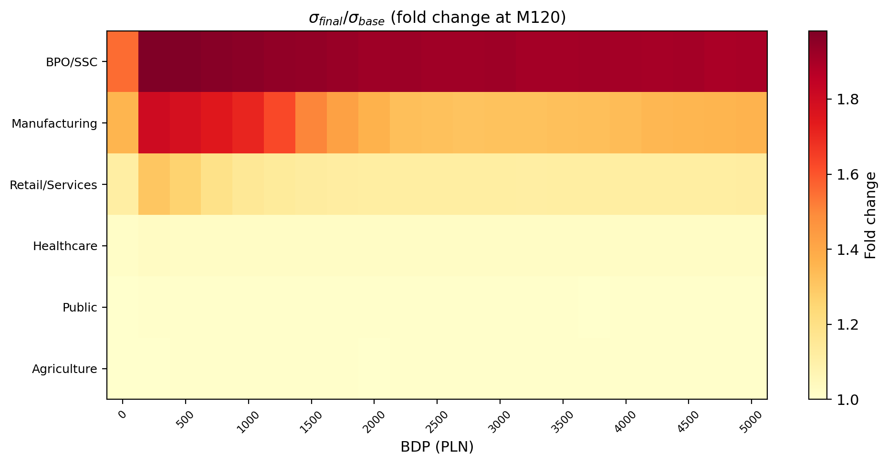
**Fig 4.** Heatmap of σ fold change across all BDP levels and sectors. The strongest growth occurs in the critical region (BDP 250–750), not at the highest subsidies.

### Network Evolution

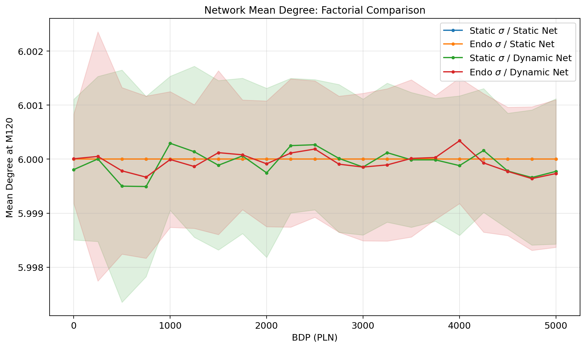
**Fig 5.** Mean degree at month 120 across factorial cells. Static cells hold at ⟨k⟩ = 6; dynamic rewiring causes modest decline from death-birth turnover.

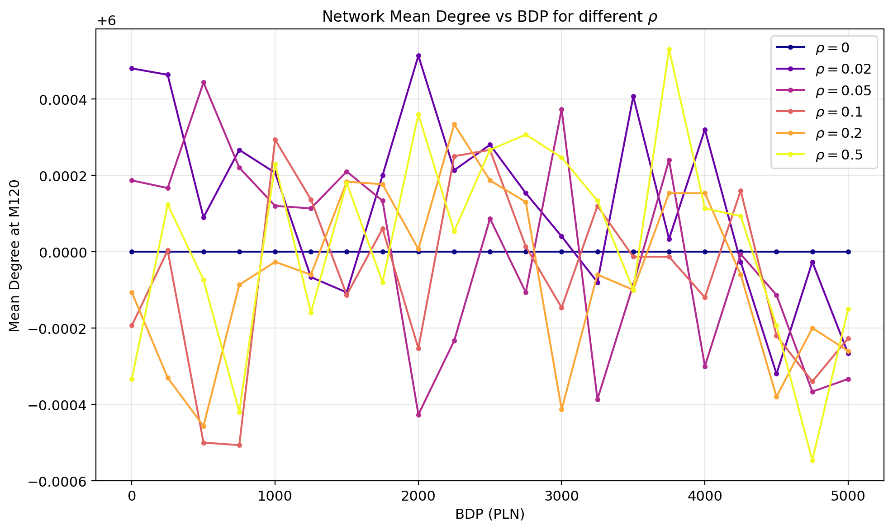
**Fig 6.** Mean degree vs BDP for different rewiring rates ρ. Higher ρ increases degree variation but the mean stays close to the initial k = 6.

### λ Sensitivity (Learning Rate)

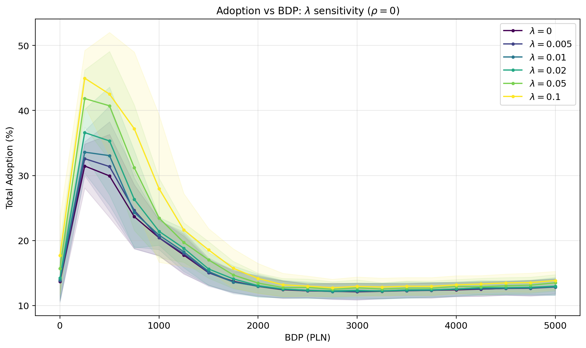
**Fig 7.** Adoption curves for each learning rate λ. Higher λ raises peak adoption monotonically while preserving the reentrant shape.

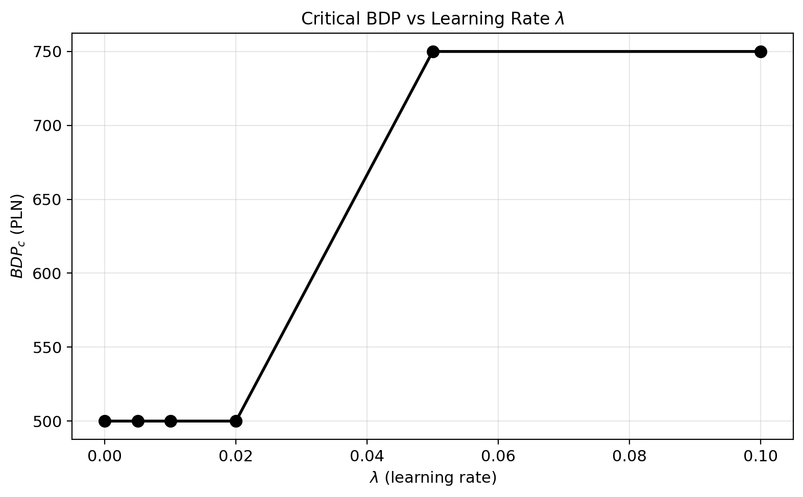
**Fig 8.** Critical BDP vs learning rate. BDP_c is rock-stable at 500 for λ ≤ 0.02, then jumps discretely to 750 at λ ≥ 0.05 — a threshold effect.

### ρ Sensitivity (Rewiring Rate)

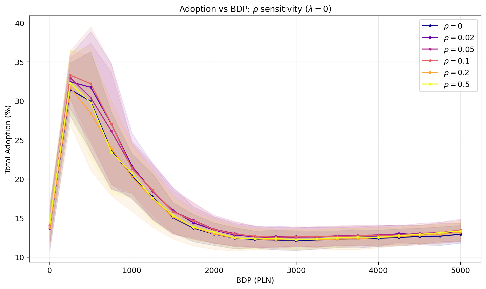
**Fig 9.** Adoption curves for each rewiring rate ρ. Moderate rewiring boosts adoption near criticality; excessive rewiring shows diminishing returns.

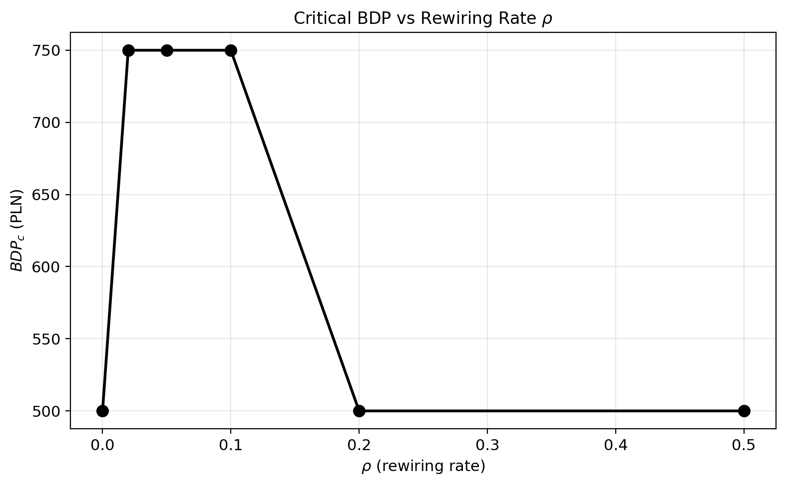
**Fig 10.** Critical BDP vs rewiring rate — strikingly non-monotonic. Preferential attachment shifts BDP_c to 750 at intermediate ρ, but high ρ destroys network structure faster than it forms, reverting to BDP_c = 500.

### Universality & SOC Diagnostic

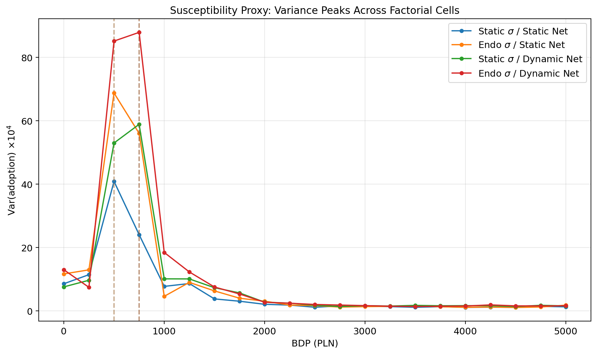
**Fig 11.** Susceptibility proxy (variance peaks) across all four cells. Peaks cluster in the BDP 250–750 band — the critical region is only mildly perturbed by endogenization.

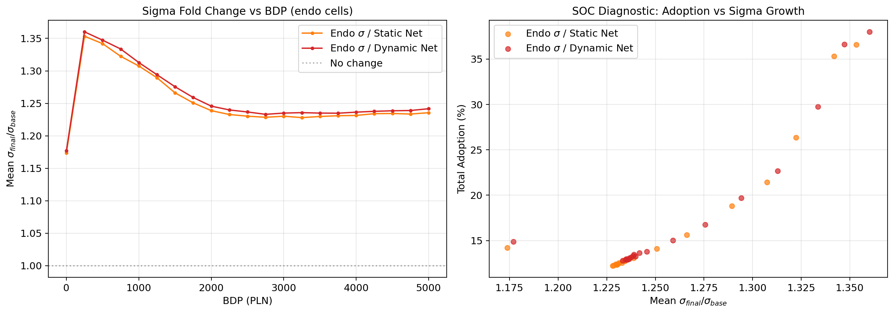
**Fig 12.** SOC diagnostic: σ does not converge to a critical attractor. Instead, a positive feedback loop (adoption → σ growth → more adoption) amplifies the transition without self-tuning.

## Repository Structure

```
analysis/python/       — 7 analysis scripts generating 12 figures
figures/               — Generated PNG figures (200 DPI)
latex/                 — Paper source (XeLaTeX + biblatex)
simulations/
  scripts/             — Campaign runner scripts
  results/             — Terminal CSV files (European format)
```

## Dependencies

- **Engine**: [complexity-econ/core](https://github.com/complexity-econ/core) (Scala 3.5.2, sbt)
- **Analysis**: Python 3 (matplotlib, numpy, pandas, seaborn)
- **Paper**: XeLaTeX + biblatex

## Running

```bash
# Run all simulation campaigns (~3h on M-series Mac)
cd simulations/scripts && bash run_all.sh

# Generate all figures
cd analysis/python && for f in factorial_bifurcation sigma_trajectories network_evolution lambda_sensitivity rho_sensitivity universality_test; do python3 ${f}.py; done

# Compile paper
cd latex && xelatex paper_en.tex && bibtex paper_en && xelatex paper_en.tex && xelatex paper_en.tex
```

## Series

| # | Paper | DOI |
|---|-------|-----|
| 01 | [The Acceleration Paradox](https://github.com/complexity-econ/paper-01-acceleration-paradox) | [10.5281/zenodo.18727928](https://doi.org/10.5281/zenodo.18727928) |
| 02 | [Monetary Regime & Automation](https://github.com/complexity-econ/paper-02-monetary-regimes) | [10.5281/zenodo.18740933](https://doi.org/10.5281/zenodo.18740933) |
| 03 | [Empirical σ Estimation](https://github.com/complexity-econ/paper-03-empirical-sigma) | [10.5281/zenodo.18743780](https://doi.org/10.5281/zenodo.18743780) |
| 04 | [Phase Diagram & Universality](https://github.com/complexity-econ/paper-04-phase-diagram) | [10.5281/zenodo.18751083](https://doi.org/10.5281/zenodo.18751083) |
| **05** | **Endogenous Technology & Networks** | *this repo* |

## License

MIT
